# best-skills

通用高质量 Skill 合集，可安装到 Cursor、Claude Code、Codex、OpenClaw 等 Agent 工具的 skills 目录使用。

**与 [best-prompts](https://github.com/xstongxue/best-prompts) 的区别**：best-prompts 是面向聊天框的 Prompt，需手动复制粘贴；best-skills 是面向 Agent 的 SKILL.md，Agent 会根据 `description` 中的关键词与触发场景**自动判断是否调用**，无需每次手动选择。

## 效果预览

**公众号封面（[wechat-article-writer](skills/wechat-article-writer/SKILL.md)）** · 源文件：[wechat_cover.drawio](preview/wechat-cover.drawio)

**公众号封面（[wechat-article-writer](skills/wechat-article-writer/SKILL.md)）** · 源文件：[wechat-xs-parser-cover.drawio](preview/wechat-xs-parser-cover.drawio)

**16:9封面（[wechat-article-writer](skills/wechat-article-writer/SKILL.md)）** · 源文件：[wechat_cover_169.drawio](preview/16to9_cover.drawio)

**手绘图（[excalidraw-diagram](skills/excalidraw-diagram/SKILL.md)）** · 源文件：[excalidraw-transformer.excalidraw](preview/excalidraw-transformer.excalidraw)

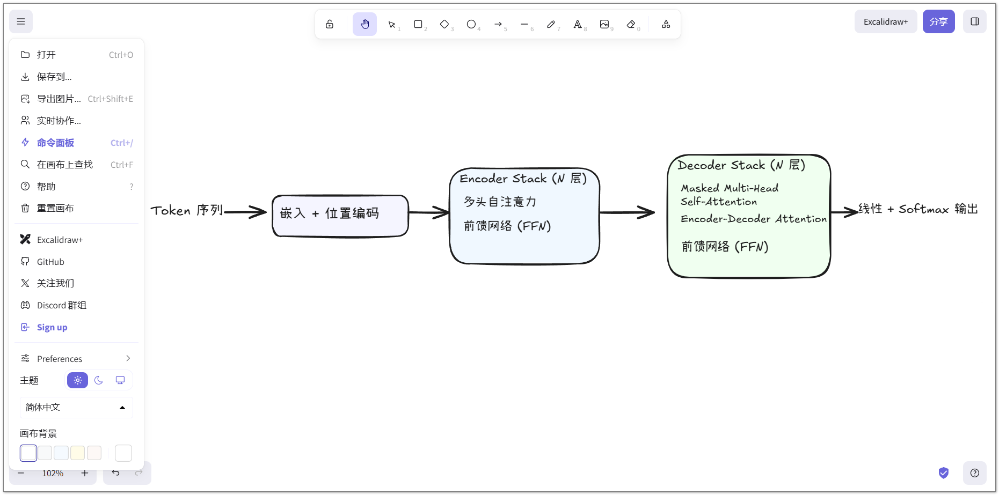

**答辩 PPT（[pptgen-drawio](skills/pptgen-drawio/SKILL.md)）**

- **风格一 · 经典学术**：源文件  
  [paper-defense-style1-classic.drawio](preview/paper-defense-style1-classic.drawio) · [paper-defense-style1-classic.pptx](preview/paper-defense-style1-classic.pptx)
- **风格四 · 科技明快**：源文件  
  [paper-defense-style4-tech.drawio](preview/paper-defense-style4-tech.drawio) · [paper-defense-style4-tech.pptx](preview/paper-defense-style4-tech.pptx)

<table><tr>
<td>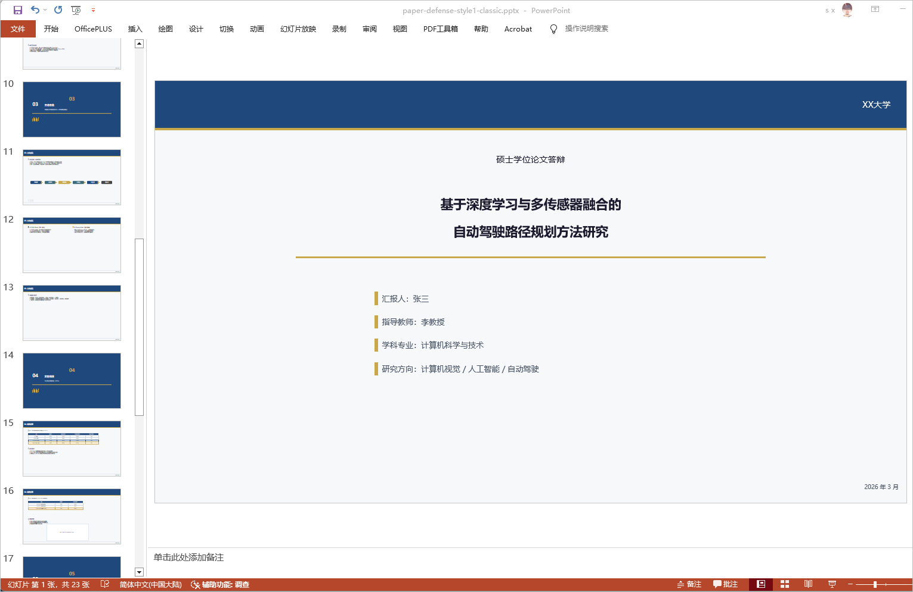</td>
<td>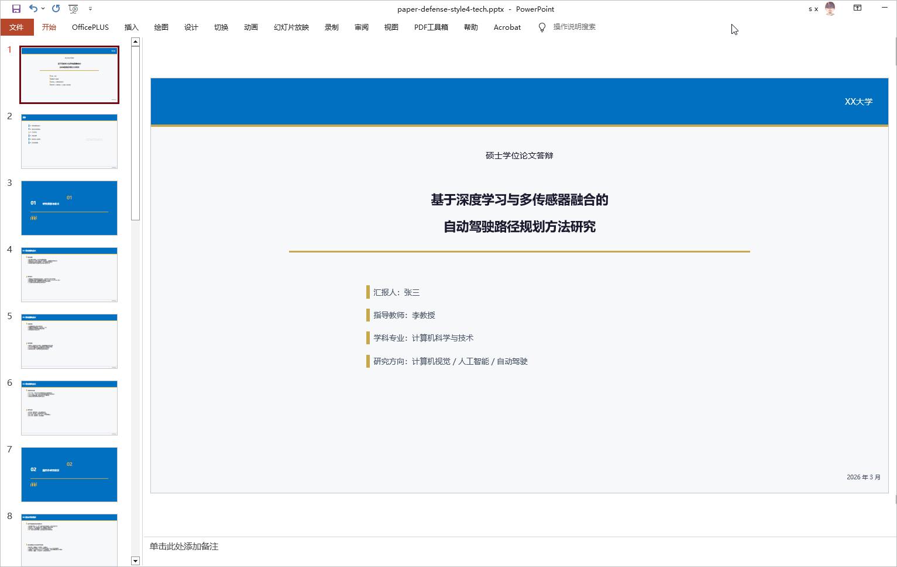</td>
</tr></table>

**技术架构图（[drawio-diagram](skills/drawio-diagram/SKILL.md)）** · 支持深度学习模型架构图、算法流程图、UML 时序图

<table><tr>
<td>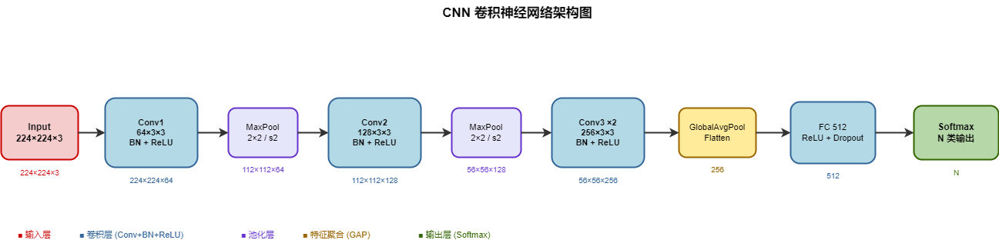 CNN架构图 · 源文件：<a href="preview/cnn-architecture.drawio">cnn-architecture.drawio</a></td>
<td>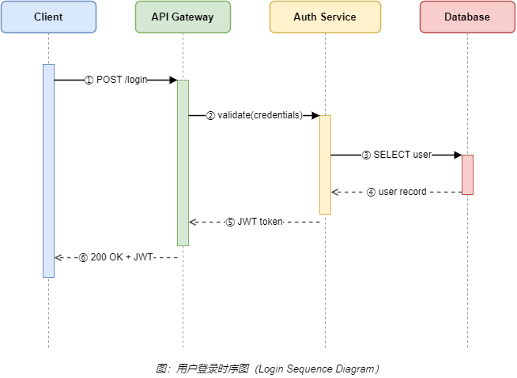 UML 时序图 · 源文件：<a href="preview/uml-sequence-login.drawio">uml-sequence-login.drawio</a></td>
</tr></table>

**考试示意图（[drawio-diagram](skills/drawio-diagram/SKILL.md)）** · 支持数学、物理、化学、生物、地理、历史、语文

<table>
<tr>
<td align="center">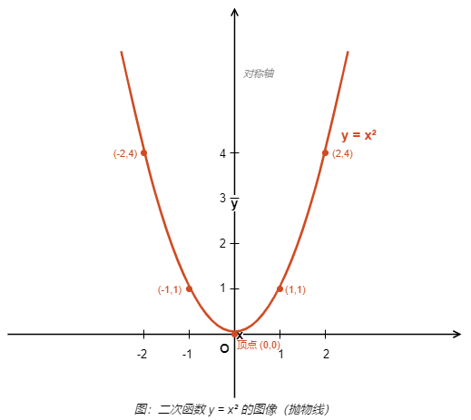 数学·函数图像</td>
<td align="center">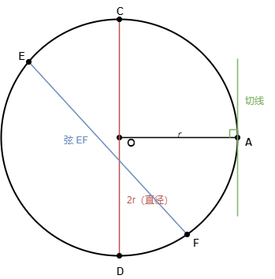 数学·圆</td>
<td align="center">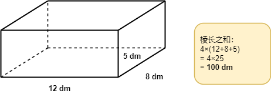 数学·长方体</td>
<td align="center">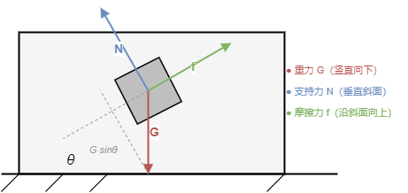 物理·斜面受力</td>
</tr>
<tr>
<td align="center">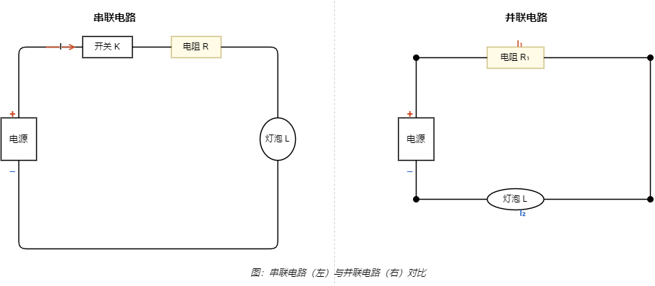 物理·电路图</td>
<td align="center">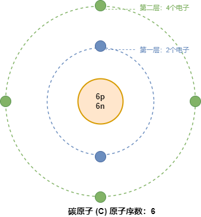 化学·原子结构</td>
<td align="center">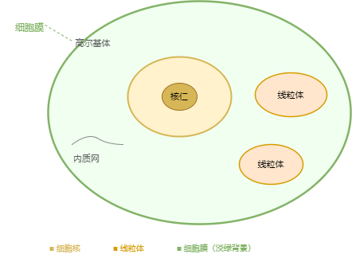 生物·细胞结构</td>
<td align="center">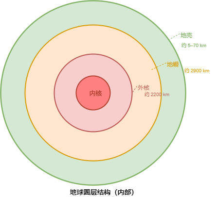 地理·地球圈层</td>
</tr>
<tr>
<td align="center">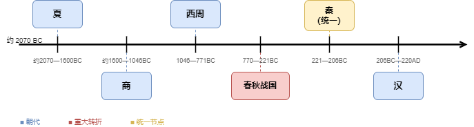 历史·朝代时间轴</td>
<td align="center">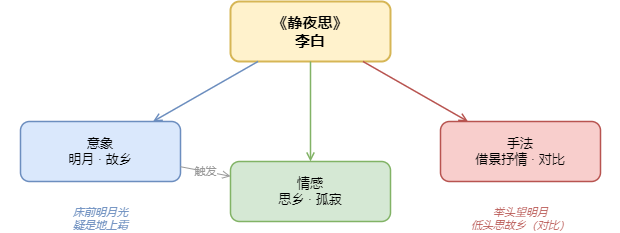 语文·古诗分析</td>
<td></td>
<td></td>
</tr>
</table>

## 本科&硕士学位论文

| 用途                | Skill         | 示例 Prompt                                         |
| ----------------- | ------------- | ------------------------------------------------- |
| 大纲审核（理工/文科）       | paper-write   | 「帮我审核一下这个论文大纲」（理工科 / 文科自动区分）                      |
| 结构仿写（理工 science）   | paper-write   | 「按这篇范文仿写我的实验章节」「帮我写绪论/摘要，参考 XX 论文」               |
| 结构仿写（文科 liberal）   | paper-write   | 「文科仿写文献综述/理论章节」「文科仿写案例分析/对策建议」「写文科摘要」             |
| 润色 / 去 AI 化       | paper-write   | 「这段读起来像 AI 写的，帮我润色」「实验章节润色」「文科章节润色」              |
| 参考文献              | paper-write   | 「帮我找 RLHF 代表作并给 BibTeX」「cite Vaswani 的 attention」 |
| 结构化信息提取           | paper-write   | 「从这篇论文提取结构化信息，用于答辩 PPT」                           |
| 系统章节生成            | codegen-doc   | 「根据当前项目生成系统总体设计章节」                                |
| 答辩 PPT / 通用汇报 PPT | pptgen-drawio | 「帮我做答辩 PPT，论文在 xxx」「根据这个大纲生成汇报 PPT」               |

> **paper-write**：统一 Skill，**理工（science-*）与文科（liberal-*）命名区分**。支持大纲审核（理工/文科）、结构仿写（理工：绪论/摘要/实验；文科：绪论/摘要/文献综述/案例分析/对策）、参考文献、润色（通用/实验章节/文科章节）、扩写/缩写、防 AIGC、中英互译、结构化信息提取。  
> **codegen-doc**：统一 Skill，匹配论文章节、项目梳理、重点问题、简历项目描述。  
> **pptgen-drawio**：支持论文答辩与通用汇报两种模式，页数按答辩时长换算，正文字号按画布 40 pt（≈ 常规 PPT 27 pt）。流程是生成 `.drawio` → 导出 `.pptx` → **必跑修补脚本**（中文文本框会被误判成不换行，字冲出画布）→ 量真实字体宽度校验有没有溢出。  
> 模型架构图、技术栈图、考试示意图等详见「[图表绘制](#图表绘制)」章节。

## 中文发明专利

| 用途 | Skill | 示例 Prompt |
| --- | --- | --- |
| 完整发明专利（全文） | patent-write | 「帮我写一份完整的发明专利」「提供技术方案，写完整说明书」 |
| 题目优化 / 收敛 | patent-write | 「帮我优化这个专利题目」「题目太宽泛，帮我收敛」 |
| 摘要 | patent-write | 「根据技术方案写摘要」 |
| 背景技术 | patent-write | 「写背景技术，突出现有方案的缺陷」 |
| 发明内容（技术方案 + 有益效果） | patent-write | 「写发明内容章节」 |
| 权利要求 | patent-write | 「帮我写独立权利要求和从属权利要求」 |
| 附图说明 | patent-write | 「根据附图写附图说明」 |
| 附图绘制（Draw.io 黑白中文） | patent-write | 「帮我画专利附图」 |
| 具体实施方式 | patent-write | 「展开具体实施方式，结合附图编号」 |
| 统稿 / 术语一致性检查 | patent-write | 「帮我统稿，检查术语是否一致」 |
| 参考专利蒸馏 / 仿写 | patent-write | 「分析这篇参考专利的写法套路」 |

> **patent-write**：中文发明专利全流程 Skill，支持题目、摘要、背景技术、发明内容、权利要求、附图说明、附图绘制（Draw.io）、具体实施方式、统稿自检、参考专利蒸馏。默认写作顺序：提炼创新点 → 权利要求骨架 → 摘要/发明内容 → 具体实施方式 → 统稿。

## 图表绘制

| 用途 | Skill | 示例 Prompt |
| --- | --- | --- |
| 图片风格迁移 | drawio-diagram | 「按这张参考图的风格画」「照这个排版画三层系统，前端 Vue、后端 Spring、数据库 MySQL」 |
| 深度学习模型架构图（CNN / Transformer / RNN 等） | drawio-diagram | 「画一个 CNN 架构图」「做 Transformer 结构图」 |
| 算法流程图 / 数据流图 | drawio-diagram | 「画反向传播流程图」「做一张数据处理流程图」 |
| 考试示意图（数学 / 物理 / 化学 / 生物 / 地理 / 历史 / 语文） | drawio-diagram | 「画物理斜面受力图」「绘制圆的基本元素」「画长方体标注尺寸」 |
| 数学函数图像（抛物线 / 一次函数 / 三角函数） | drawio-diagram | 「画 y=x² 的图像」「绘制 y=2x-1 函数图像，标注截距」 |
| 物理电路图（串联 / 并联 / 含电流表和电压表） | drawio-diagram | 「画串联电路图（电源-开关-电阻-灯泡）」「画含电压表的并联电路」 |
| UML 时序图 / 类图 / 状态图 | drawio-diagram | 「画用户登录的时序图」「画这个系统的 UML 类图」 |
| 技术栈图 | codegen-diagram | 「根据当前项目画技术栈结构图」 |
| 系统架构图 | codegen-diagram | 「画我们系统的四层架构图」 |
| 数据结构图 | codegen-diagram | 「根据代码生成数据结构图」 |
| E-R 图 | codegen-diagram | 「根据数据库表结构画 E-R 图」 |
| 手绘风图表 | excalidraw-diagram | 「用手绘风格画系统架构图」「手绘流程图，发给非技术同事看」 |

> **drawio-diagram**：支持**风格迁移**与**从零生成**两种模式。风格迁移：上传参考图 + 描述内容 → 按参考图风格输出新图；从零生成覆盖：深度学习模型图（CNN / Transformer / GAN 等）、算法流程图、考试示意图（数学几何与函数 / 物理受力与电路 / 化学结构 / 生物细胞 / 地理圈层 / 历史时间轴 / 语文分析）、**UML 时序图 / 类图 / 状态图**。  
> **codegen-diagram**：读取当前项目代码，自动匹配技术栈图、系统架构图、数据结构图、E-R 图四种类型。  
> **excalidraw-diagram**：手绘风格，适合白板草图与非正式架构说明，输出标准 `.excalidraw` 文件。

## 开发流程五步法

| 步骤     | Skill        | 示例 Prompt                           |
| ------ | ------------ | ----------------------------------- |
| 需求理解   | dev-workflow | 「我想做一个 XXX，帮我整理需求」                  |
| 方案设计   | dev-workflow | 「需求已整理好，帮我做技术方案」「架构设计：前后端分离」        |
| 代码实现   | dev-workflow | 「按方案开始写代码」「实现用户登录模块」                |
| 代码审查   | dev-workflow | 「帮我审查这段代码」「PR review，按团队规范检查」       |
| Bug 修复 | dev-workflow | 「这里报错了：xxx」「功能跑不通，帮我修」「测试挂了，看看怎么回事」 |

> **dev-workflow**：根据用户表述自动匹配 requirement/design/implementation/review/bug-fix 五步之一。

## 自媒体创作

| 用途                   | Skill                 | 示例 Prompt                                         |
| -------------------- | --------------------- | ------------------------------------------------- |
| 公众号/技术博客（含配图）        | wechat-article-writer | 「写一篇关于 Cursor Skills 的公众号文章」「用高流量风格写 Vibe Coding」 |
| 公众号封面 / B站封面 / 小红书配图 | wechat-article-writer | 「生成这篇文章的封面」（默认合并封面 1283×383，含大封面+小封面）          |
| 正文插图                 | wechat-article-writer | 「生成 Cursor 启用四步骤的步骤图」「画 Prompt/Rules/Skills 对比图」  |
| 风格提取                 | wechat-article-writer | 「分析这篇公众号文章的写作风格」「提取可复用规则」「模仿这篇爆款文风」               |

> **wechat-article-writer**：统一 Skill，根据用户表述自动匹配撰写文章、封面图、正文插图、风格提取。支持 9 种写作风格（按序）：默认、高流量、清单体、资源盘点、个人实测、认知颠覆、身份共鸣、故事化、深度随笔。

## 前端界面设计

| 用途       | Skill           | 示例 Prompt                                            |
| -------- | --------------- | ---------------------------------------------------- |
| 前端界面设计生成 | frontend-design | 「做一个产品落地页，编辑/杂志风」「写一个登录组件，极简克制」「美化这个仪表盘，科技感强一点」 |

> **frontend-design**：生成具有高设计品质、可交付生产的前端界面，规避「AI 通用审美」。动手前先选定美学方向（极简/繁复/复古/玩具感等），支持原生 HTML/CSS/JS、React、Vue，产出有创意、有记忆点的代码与设计。

## 周报 / 汇报 / 总结 / 介绍

| 用途      | Skill             | 示例 Prompt             |
| ------- | ----------------- | --------------------- |
| 周报      | md-report-summary | 「帮我写本周周报，结合websearch」 |
| 工作汇报    | md-report-summary | 「写一份 Q1 工作汇报」「整理汇报材料」 |
| 总结 / 复盘 | md-report-summary | 「写项目总结」「帮我复盘这次活动」     |
| 介绍      | md-report-summary | 「写一份项目介绍」「个人简介」       |

> **md-report-summary**：无草稿时从 Web 搜索并总结；有草稿时结合草稿整理、补充、润色。输出 Markdown。

## 项目文档与简历

| 用途     | Skill       | 示例 Prompt               |
| ------ | ----------- | ----------------------- |
| 项目整体梳理 | codegen-doc | 「按这个格式梳理我们项目：概述、模块、技术栈」 |
| 项目重点问题 | codegen-doc | 「梳理这个项目的技术难点和待解决问题」     |
| 简历项目描述 | codegen-doc | 「按这个格式把当前项目写成简历项目经历」    |

> **codegen-doc**：根据用户表述自动匹配论文章节、项目梳理、重点问题、简历项目描述。产出给导师、评委、HR、领导看，格式由对方指定。要给新同事看的上手文档，用下面的 project-docs。

## 项目深度文档

| 用途 | Skill | 示例 Prompt |
| --- | --- | --- |
| 生成 9 篇新人文档（架构/设计/代码导读/运行时等） | project-docs | 「帮我为这个项目生成新人文档」「深入理解这个项目，写文档」「帮我写项目文档给新来的同事看」 |
| 只生成其中某几篇 | project-docs | 「帮我写这个项目的架构文档和调试指南」 |
| 代码改动后更新文档 | project-docs | 「代码改了，更新一下项目文档」 |

> **project-docs**：给任意代码项目写一套新人上手文档，输出到 `docs/`。9 篇按阅读顺序编号：架构总览 → 设计思想 → 语言特性 → 代码导读 → 运行时模型 → 构建指南 → 对接指南 → 调试指南 → 设计规范，每篇 300–600 行；可全写、只写几篇，或代码改动后只更新受影响的篇目。先按项目类型（系统 / Web 后端 / 前端 / 库 / 数据脚本）决定哪几篇换写法、哪几篇跳过。引用代码带 `path:line`；`docs/` 非空时先问覆盖还是备份。

## 工具与扩展

| 用途                | Skill                | 示例 Prompt                          |
| ----------------- | -------------------- | ---------------------------------- |
| Skill 创建          | skill-create         | 「我经常要审查论文，帮我创建一个 Skill」            |
| Skill 与 Prompt 互转 | skill-prompt-convert | 「把这个 Skill 转成聊天框可用的 Prompt」        |

## 使用方式

官方参考文档：

> - Claude Code：[https://github.com/anthropics/skills](https://github.com/anthropics/skills)
> - Codex：[https://github.com/openai/skills](https://github.com/openai/skills)
> - Cursor：[https://cursor.com/cn/docs/context/skills](https://cursor.com/cn/docs/context/skills)
> - Trae：[https://docs.trae.cn/ide/skills](https://docs.trae.cn/ide/skills)
> - Github Copilot：[https://code.visualstudio.com/docs/copilot/customization/agent-skills](https://code.visualstudio.com/docs/copilot/customization/agent-skills)
> - OpenSkills：[https://github.com/numman-ali/openskills](https://github.com/numman-ali/openskills)
> - OpenClaw：[https://docs.openclaw.ai/zh-CN/tools/skills](https://docs.openclaw.ai/zh-CN/tools/skills)

将 `skills/` 目录下的各 skill 文件夹复制到 IDE/插件 的 skills 目录，例如：

- **Cursor**：`C:/Users/xs/.cursor/skills/` 或项目内 `.cursor/skills/`
- **Claude Code**：`C:/Users/xs/.claude/skills/` 或项目内 `.claude/skills/`
- **Codex**：`C:/Users/xs/.codex/skills/` 或项目内 `.codex/skills/`
- **OpenCode**：`C:/Users/xs/.config/opencode/skills/` 或项目内 `.opencode/skills/`

## 更多公开 Skills 资源

[小帅储物间](https://xiaoshuai.site/xiaoshuai)：[01 爆火AI] -> [00.AI 编程 & Vibe Coding] 文件夹中已更新，按需取用。

**合集网站**：想快速找到现成技能，从这里入手

| 网站                                                   | 特点                   | 适合谁            |
| ---------------------------------------------------- | -------------------- | -------------- |
| [SkillsMP](https://skillsmp.com/)                    | 模板商店，已有 36 万+        | 想挑成品技能包的       |
| [agent-skills.md](https://agent-skills.md/)          | 收录 6000+ 常用技能，强调直接可用 | 想快速上手，不想自己写的   |
| [Agent Skills Me](https://agentskills.me/)           | 人工精选，"精而少"           | 不想花时间筛选的       |
| [Skills Directory](https://www.skillsdirectory.com/) | Reddit 社区推荐，偏口碑榜单    | 想看真实评价再决定的     |
| [SkillStore](https://skillstore.io/zh-hans)          | 中文友好，经过安全审查          | 团队使用或合规敏感场景    |
| [Skills.sh](https://skills.sh/)                      | 热门趋势技能，支持一键安装        | 想快速尝鲜新技能的      |
| [aitmpl.com/skills](https://www.aitmpl.com/skills)   | Claude Code 模板集合     | Claude Code 用户 |

**源码仓库**：想学实现、深度定制，看这里

| 仓库                                                                                                 | 特点                                        |
| -------------------------------------------------------------------------------------------------- | ----------------------------------------- |
| [Anthropic Skills](https://github.com/anthropics/skills)                                           | 官方维护，最佳实践参考                               |
| [Antfu Skills](https://github.com/antfu/skills)                                                    | 知名开发者实践，工程化质量高                            |
| [Vercel Agent Skills](https://github.com/vercel-labs/agent-skills)                                 | 偏 Web / 全栈场景                              |
| [Awesome Agent Skills](https://github.com/JackyST0/awesome-agent-skills)                           | 社区精选索引，「awesome 系」风格                      |
| [Xquik x-twitter-scraper](https://github.com/Xquik-dev/x-twitter-scraper/tree/master/skills/x-twitter-scraper) | X/Twitter 数据与自动化 Skill，支持 REST、MCP、webhooks 与 SDK 路由 |
| [Ultimate Agent Skills Collection](https://github.com/ZhanlinCui/Ultimate-Agent-Skills-Collection) | 多来源汇总，适合深挖扫货                              |
| [Awesome OpenClaw Skills](https://github.com/VoltAgent/awesome-openclaw-skills)                    | OpenClaw 专属，5400+ 技能已分类                   |
| [code-review-skill](https://github.com/awesome-skills/code-review-skill)                           | 代码审查专项，覆盖 React / Vue / Rust / TypeScript |
